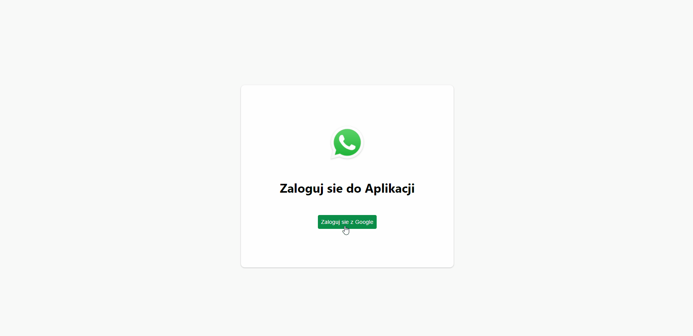
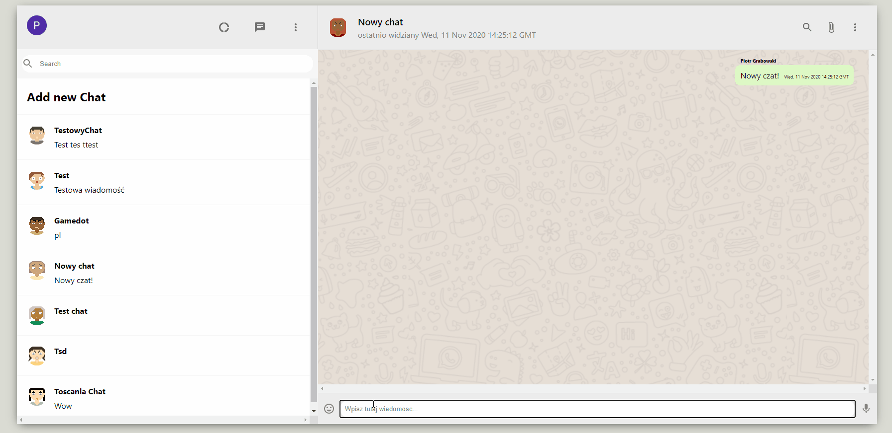
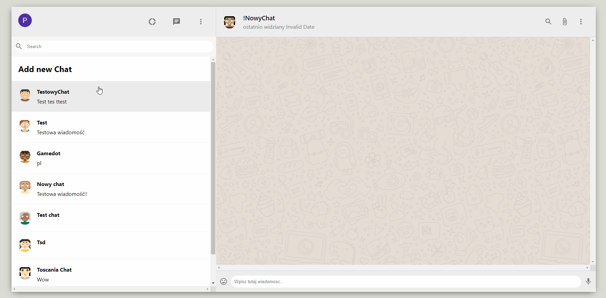

# WhatsApp Clone

## Aplikacja składa się z:

- React
- React Router
- React Context API
- Material UI
- Firebase Google Authentication
- Firebase RealTime Database

Hosting Firebase [LIVE DEMO](https://whats-app-clone-40311.web.app/)

## Możliwości:

### Bezpieczne logowanie za pomocą Firebase Google Authentication

### Wiadomości w czasie rzeczywistym

### Zakładanie nowego kanału rozmowy

